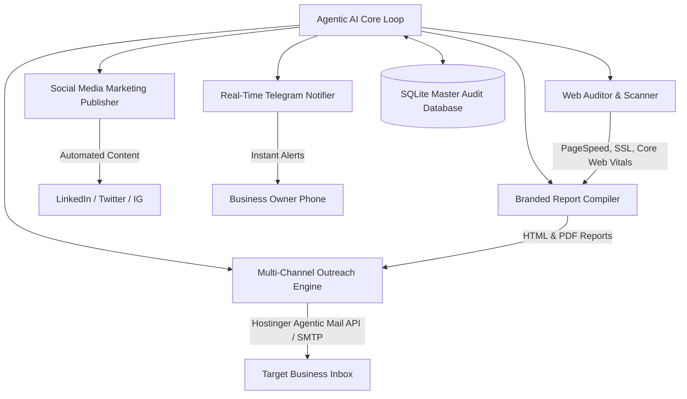

# 🤖 24/7 Autonomous Agentic AI Business & Marketing Engine

> **Powered by Orange Future Tech** | Autonomous Lead Generation, Web Health Diagnostics, Branded Outreach, Social Media Publishing, and Real-Time Telemetry.

---

## 🌟 Architecture Overview



---

## 🚀 Key Modules & Components

| Module | File | Purpose |
| :--- | :--- | :--- |
| **Orchestrator** | `agent_core.py` | 24/7 continuous autonomous execution loop. |
| **Web Auditor** | `auditor.py` | Scans target web apps for performance bottlenecks, SSL status, and SEO tags. |
| **Report Generator** | `report_generator.py` | Generates 3-page executive technical audit reports in HTML & PDF formats. |
| **Email Engine** | `cold_outreach.py` | Dispatches native emails via Hostinger Agentic Mail API (`teams@orangefuturetech.com`) & SMTP. |
| **Social Publisher** | `social_engine.py` | Auto-generates daily technical marketing posts for LinkedIn, Twitter, and Instagram. |
| **Telemetry & Alerts**| `notifier.py` | Sends real-time Telegram alerts to business owner on lead discovery and email dispatches. |
| **Master Database** | `db.py` | Manages SQLite database (`audit_engine.db`) for leads, posts, and action logs. |
| **API Server** | `server.py` | Password-protected Python HTTP server handling SHA-256 admin auth and `.env` sync. |
| **CLI Manager** | `manage.py` | Command-line management tool for managing leads, audit logs, and dispatch modes. |

---

## 🛠️ CLI Quickstart

### 1. Run Autonomous AI Cycle
```bash
python3 ai-engine/agent_core.py
```

### 2. Run API Security Server
```bash
python3 ai-engine/server.py
```

### 3. Manage Leads & Logs via CLI
```bash
# View all discovered leads
python3 ai-engine/manage.py leads

# View recent execution logs
python3 ai-engine/manage.py logs

# Add a target lead manually
python3 ai-engine/manage.py add "Target Company" "https://targetcompany.com" "contact@targetcompany.com"
```

---

## 🔒 Security & Verification

- **Hostinger Agentic Mail API Integration**: Emails are sent natively from `teams@orangefuturetech.com` with DKIM signatures and SPF validation.
- **SHA-256 Protected Portal**: Admin API key changes require SHA-256 password challenge verification.
- **Environment Isolation**: All sensitive tokens are managed in `.env` and ignored from git tracking via `.gitignore`.
